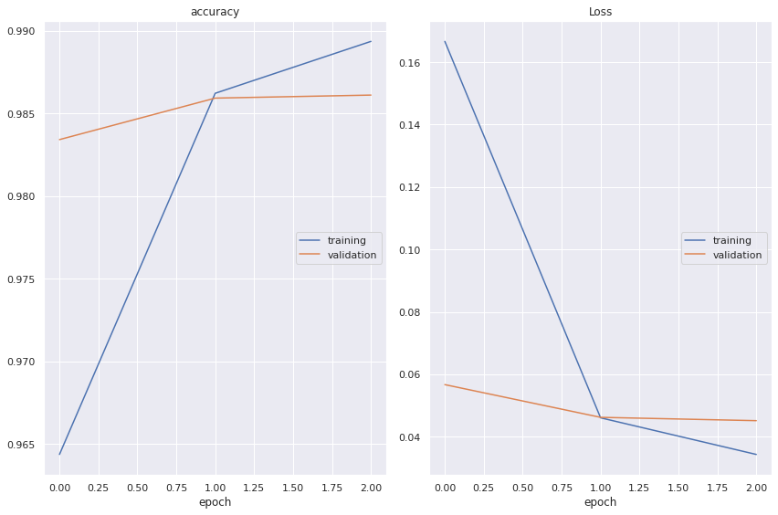

<h2 align=center> Named Entity Recognition (NER) using LSTMs with Keras</h2>

### Dataset Source

- [NER Dataset](https://www.kaggle.com/abhinavwalia95/entity-annotated-corpus)

## Model Used

1. Bi-directional LSTM
2. Bi-directional GRU

**Notes: Bi-directional GRU performed well.**

## Performance (Bi-directional GRU) 

<table>
  <tr>
    <td></td>
  </tr>
 </table>

### Some prediction (Bi-directional GRU)

```python
get_ner('Sunday is close day for London .')
```

    Sunday         	B-tim
    London         	B-geo


```python
get_ner('I will go to London from Indonesia Sunday Morning .')
```

    London         	B-geo
    Indonesia      	B-geo
    Sunday         	B-tim
    Morning        	I-tim


```python
get_ner('U.S. President George Bush will visit the Vatican city Tomorrow Morning .')
```

    U.S.           	B-org
    President      	B-per
    George         	I-per
    Bush           	I-per
    Vatican        	B-org
    Tomorrow       	B-geo
    Morning        	I-org

