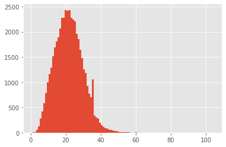
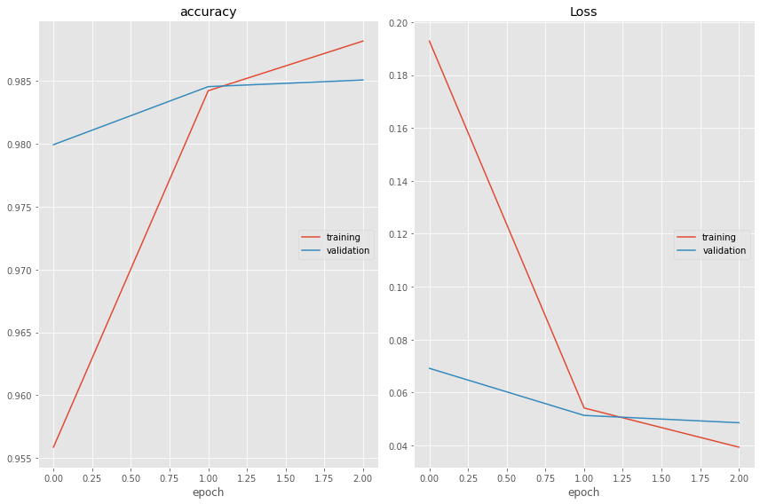

<h2 align=center> Named Entity Recognition (NER) using LSTMs with Keras</h2>

Named-Entity Recognition model using Deep Neural Network and Python.

### Task 1: Project Overview and Import Modules


```python
%matplotlib inline
import matplotlib.pyplot as plt
import pandas as pd
import numpy as np
np.random.seed(0)
plt.style.use("ggplot")

import tensorflow as tf
print('Tensorflow version:', tf.__version__)
print('GPU detected:', tf.config.list_physical_devices('GPU'))
```

    Tensorflow version: 2.3.0
    GPU detected: []


### Task 2: Load and Explore the NER Dataset

*Essential info about tagged entities*:
- geo = Geographical Entity
- org = Organization
- per = Person
- gpe = Geopolitical Entity
- tim = Time indicator
- art = Artifact
- eve = Event
- nat = Natural Phenomenon


```python
data = pd.read_csv('ner_dataset.csv', encoding='latin1')
data = data.fillna(method='ffill')
data.head(20)
```


<div>
<style scoped>
    .dataframe tbody tr th:only-of-type {
        vertical-align: middle;
    }

    .dataframe tbody tr th {
        vertical-align: top;
    }

    .dataframe thead th {
        text-align: right;
    }
</style>
<table border="1" class="dataframe">
  <thead>
    <tr style="text-align: right;">
      <th></th>
      <th>Sentence #</th>
      <th>Word</th>
      <th>POS</th>
      <th>Tag</th>
    </tr>
  </thead>
  <tbody>
    <tr>
      <th>0</th>
      <td>Sentence: 1</td>
      <td>Thousands</td>
      <td>NNS</td>
      <td>O</td>
    </tr>
    <tr>
      <th>1</th>
      <td>Sentence: 1</td>
      <td>of</td>
      <td>IN</td>
      <td>O</td>
    </tr>
    <tr>
      <th>2</th>
      <td>Sentence: 1</td>
      <td>demonstrators</td>
      <td>NNS</td>
      <td>O</td>
    </tr>
    <tr>
      <th>3</th>
      <td>Sentence: 1</td>
      <td>have</td>
      <td>VBP</td>
      <td>O</td>
    </tr>
    <tr>
      <th>4</th>
      <td>Sentence: 1</td>
      <td>marched</td>
      <td>VBN</td>
      <td>O</td>
    </tr>
    <tr>
      <th>5</th>
      <td>Sentence: 1</td>
      <td>through</td>
      <td>IN</td>
      <td>O</td>
    </tr>
    <tr>
      <th>6</th>
      <td>Sentence: 1</td>
      <td>London</td>
      <td>NNP</td>
      <td>B-geo</td>
    </tr>
    <tr>
      <th>7</th>
      <td>Sentence: 1</td>
      <td>to</td>
      <td>TO</td>
      <td>O</td>
    </tr>
    <tr>
      <th>8</th>
      <td>Sentence: 1</td>
      <td>protest</td>
      <td>VB</td>
      <td>O</td>
    </tr>
    <tr>
      <th>9</th>
      <td>Sentence: 1</td>
      <td>the</td>
      <td>DT</td>
      <td>O</td>
    </tr>
    <tr>
      <th>10</th>
      <td>Sentence: 1</td>
      <td>war</td>
      <td>NN</td>
      <td>O</td>
    </tr>
    <tr>
      <th>11</th>
      <td>Sentence: 1</td>
      <td>in</td>
      <td>IN</td>
      <td>O</td>
    </tr>
    <tr>
      <th>12</th>
      <td>Sentence: 1</td>
      <td>Iraq</td>
      <td>NNP</td>
      <td>B-geo</td>
    </tr>
    <tr>
      <th>13</th>
      <td>Sentence: 1</td>
      <td>and</td>
      <td>CC</td>
      <td>O</td>
    </tr>
    <tr>
      <th>14</th>
      <td>Sentence: 1</td>
      <td>demand</td>
      <td>VB</td>
      <td>O</td>
    </tr>
    <tr>
      <th>15</th>
      <td>Sentence: 1</td>
      <td>the</td>
      <td>DT</td>
      <td>O</td>
    </tr>
    <tr>
      <th>16</th>
      <td>Sentence: 1</td>
      <td>withdrawal</td>
      <td>NN</td>
      <td>O</td>
    </tr>
    <tr>
      <th>17</th>
      <td>Sentence: 1</td>
      <td>of</td>
      <td>IN</td>
      <td>O</td>
    </tr>
    <tr>
      <th>18</th>
      <td>Sentence: 1</td>
      <td>British</td>
      <td>JJ</td>
      <td>B-gpe</td>
    </tr>
    <tr>
      <th>19</th>
      <td>Sentence: 1</td>
      <td>troops</td>
      <td>NNS</td>
      <td>O</td>
    </tr>
  </tbody>
</table>
</div>


```python
print("Unique words in corpus: ", data['Word'].nunique())
print("Unique tags in corpus: ", data['Tag'].nunique())
```

    Unique words in corpus:  35178
    Unique tags in corpus:  17


```python
words = list(set(data["Word"].values))
words.append("ENDPAD")
num_words = len(words)
```


```python
tags = list(set(data["Tag"].values))
num_tags = len(tags)
```


```python
num_words, num_tags
```


    (35179, 17)


### Task 3: Retrieve Sentences and Corresponsing Tags


```python
class SentenceGetter(object):
    def __init__(self, data):
        self.n_sent = 1
        self.data = data
        agg_func = lambda s: [(w, p, t) for w, p, t in zip(s["Word"].values.tolist(),
                                                          s["POS"].values.tolist(),
                                                          s["Tag"].values.tolist())]
        self.grouped = self.data.groupby("Sentence #").apply(agg_func)
        self.sentences = [s for s in self.grouped]
```


```python
getter = SentenceGetter(data)
sentences = getter.sentences
```


```python
sentences[0]
```


    [('Thousands', 'NNS', 'O'),
     ('of', 'IN', 'O'),
     ('demonstrators', 'NNS', 'O'),
     ('have', 'VBP', 'O'),
     ('marched', 'VBN', 'O'),
     ('through', 'IN', 'O'),
     ('London', 'NNP', 'B-geo'),
     ('to', 'TO', 'O'),
     ('protest', 'VB', 'O'),
     ('the', 'DT', 'O'),
     ('war', 'NN', 'O'),
     ('in', 'IN', 'O'),
     ('Iraq', 'NNP', 'B-geo'),
     ('and', 'CC', 'O'),
     ('demand', 'VB', 'O'),
     ('the', 'DT', 'O'),
     ('withdrawal', 'NN', 'O'),
     ('of', 'IN', 'O'),
     ('British', 'JJ', 'B-gpe'),
     ('troops', 'NNS', 'O'),
     ('from', 'IN', 'O'),
     ('that', 'DT', 'O'),
     ('country', 'NN', 'O'),
     ('.', '.', 'O')]


### Task 4: Define Mappings between Sentences and Tags


```python
# enumerate() -> add a counter to an iterable and returns it
word2idx = {w: i+1 for i, w in enumerate(words)}
tag2idx = {t: i for i, t in enumerate(tags)}
```


```python
word2idx
```


    {'admited': 1,
     'Court': 2,
     'liquor': 3,
     'Newport': 4,
     'pro-rebel': 5,
     'Mathematically': 6,
     'took': 7,
     'Lapi': 8,
     'Peschke': 9,
     'environmentalists': 10,
     'al-Basra': 11,
     'gripping': 12,
     'academics': 13,
     'settlements': 14,
     'Gniljane': 15,
     'sailed': 16,
     'choices': 17,
     'Chattisgarh': 18,
     'intercourse': 19,
     '04-Jun': 20,
     'Dhabi': 21,
     '204': 22,
     'dragons': 23,
     'aquatic': 24,
     'obliged': 25,
     'Mento': 26,
     'Joao': 27,
     'supreme': 28,
     'Jigme': 29,
     'Ging': 30,
     'achieved': 31,
     'Costa': 32,
     'stockpiles': 33,
     'Bremer': 34,
     'organic': 35,
     'canyon': 36,
     'Support': 37,
     'Fradique': 38,
     'navy': 39,
     'one-meter': 40,
     'Euro-Atlantic': 41,
     'cervical': 42,
     'Musician': 43,
     'stool': 44,
     'planet': 45,
     'Kharazzi': 46,
     'cave-ins': 47,
     'mid-2004': 48,
     'plunged': 49,
     'Bryant': 50,
     '2016': 51,
     'withstand': 52,
     'Adjustment': 53,
     '0.193': 54,
     'plantations': 55,
     'iconic': 56,
     'hijacked': 57,
     'Niger': 58,
     'mingle': 59,
     'belonged': 60,
     'F-5': 61,
     'Vandemoortele': 62,
     'Pozarevac': 63,
     '65': 64,
     'Hui': 65,
     'swore': 66,
     'printer': 67,
     'TRNC': 68,
     'upswing': 69,
     'tabulation': 70,
     'forced': 71,
     'stumbling': 72,
     'Chad-Sudan': 73,
     'Ural': 74,
     'Bachelet': 75,
     'drywall': 76,
     'Kasyanov': 77,
     'Whibley': 78,
     'Aena': 79,
     'jamming': 80,
     'drought': 81,
     'suburbs': 82,
     'Mohamud': 83,
     'referee': 84,
     'winner': 85,
     'recalled': 86,
     'Meanwhile': 87,
     'ninth-century': 88,
     'Assembly': 89,
     'inaugurated': 90,
     'demolition': 91,
     'deaf': 92,
     'Markey': 93,
     'Kayhan': 94,
     'Husseinov': 95,
     '1896': 96,
     'Dostum': 97,
     'ousted': 98,
     'stone-throwing': 99,
     'record-setting': 100,
     'timeframe': 101,
     'Hamed': 102,
     '171': 103,
     'Bern': 104,
     'destablize': 105,
     'Persistent': 106,
     'liberalize': 107,
     '1910': 108,
     'MERKEL': 109,
     'untreated': 110,
     'shelters': 111,
     'hinges': 112,
     'Khanna': 113,
     'lesson': 114,
     'detriment': 115,
     'beachfront': 116,
     'sweltering': 117,
     'Shabelle': 118,
     'chancellor': 119,
     'airplanes': 120,
     'Complaints': 121,
     'Mowlam': 122,
     'Joyful': 123,
     'thuggish': 124,
     'suitors': 125,
     'constant': 126,
     'liken': 127,
     'hoard': 128,
     'Shyam': 129,
     'comprehend': 130,
     'fluttered': 131,
     '1827': 132,
     'Advisor': 133,
     'Akhmad': 134,
     'Walayo': 135,
     'himself': 136,
     'capital-intensive': 137,
     'Orissa': 138,
     'seen': 139,
     '1.31': 140,
     'plank': 141,
     'residences': 142,
     'Palme': 143,
     'stock': 144,
     'nonetheless': 145,
     'speaker': 146,
     'headcount-control': 147,
     'Senate': 148,
     'Programming': 149,
     'Statistics': 150,
     'understating': 151,
     'Dubbed': 152,
     'produce': 153,
     'TITO': 154,
     'opposition': 155,
     'tattoo': 156,
     'Camila': 157,
     'Anbar': 158,
     'strife-torn': 159,
     'Gumushane': 160,
     'sailor': 161,
     'soon': 162,
     'win-loss': 163,
     'affair': 164,
     'Ganges': 165,
     'prevent': 166,
     'Barzani': 167,
     'Turkmens': 168,
     'erecting': 169,
     'Rodrigues': 170,
     'heckling': 171,
     'Ohno': 172,
     'policymaking': 173,
     'hardest-hit': 174,
     'ringing': 175,
     'reacted': 176,
     'lander': 177,
     '130.6': 178,
     'definitive': 179,
     'colonial': 180,
     'Actors': 181,
     'clusters': 182,
     'Franz': 183,
     'distances': 184,
     'Bukavu': 185,
     'Christians': 186,
     'scenes': 187,
     'H1-B': 188,
     'Buttiglione': 189,
     'rotating': 190,
     'Grapes': 191,
     'cloud': 192,
     'Azhar': 193,
     'appointments': 194,
     'Copenhagen': 195,
     'conclusive': 196,
     'Pattani': 197,
     'Puerto': 198,
     'Hudson': 199,
     'two-term': 200,
     'Clinton': 201,
     'Surgical': 202,
     'soles': 203,
     'investigators': 204,
     'purification': 205,
     'Dixie': 206,
     'Likud-led': 207,
     'component': 208,
     'Gulu': 209,
     'halting': 210,
     '1891': 211,
     'Wolfgang': 212,
     'Walloons': 213,
     'fling': 214,
     'clouds': 215,
     'Al-Zawahiri': 216,
     'Ceku': 217,
     'flowering': 218,
     'Little': 219,
     'unlawfully': 220,
     'Gollnisch': 221,
     'Houghton': 222,
     'Guatica': 223,
     'casual': 224,
     'Revelers': 225,
     'bowling': 226,
     'Hajdib': 227,
     'DEA': 228,
     'unlikely': 229,
     'best-preserved': 230,
     'Mehrabpur': 231,
     'Honduran': 232,
     'Crisis': 233,
     'security': 234,
     '1,27,910': 235,
     'London-based': 236,
     'discussions': 237,
     'Abdulle': 238,
     'pro-Taleban': 239,
     'Angelina': 240,
     'Susy': 241,
     'Pak': 242,
     'retirements': 243,
     'Camillo': 244,
     'Anis': 245,
     'Astros': 246,
     'venture': 247,
     'determining': 248,
     'catcher': 249,
     'intestine': 250,
     'Gaza-bound': 251,
     'outsourcing': 252,
     'deporting': 253,
     'Nursery': 254,
     'smash': 255,
     'three-hour': 256,
     'shifted': 257,
     'Tarmohammed': 258,
     'cot': 259,
     'tests': 260,
     'tools': 261,
     'Hoshide': 262,
     'Bengal': 263,
     'infidel': 264,
     'hateful': 265,
     'unchallenged': 266,
     'warmongering': 267,
     'commissions': 268,
     'savage': 269,
     'domain': 270,
     'Dam': 271,
     '200-meter': 272,
     'cantons': 273,
     'Pepsi': 274,
     'Manny': 275,
     'Kings': 276,
     'Select': 277,
     'rainstorms': 278,
     'Posada': 279,
     'deteriorate': 280,
     'Theodor': 281,
     'Younous': 282,
     'invests': 283,
     'imperialism': 284,
     'Township': 285,
     'refining': 286,
     'clearing': 287,
     'Petronas': 288,
     'pedophilia': 289,
     'Meadowbrook': 290,
     'assailed': 291,
     'pepper': 292,
     '&': 293,
     'metric': 294,
     'consult': 295,
     'Gorges': 296,
     'detonating': 297,
     'Sese': 298,
     'Kosachev': 299,
     '12-country': 300,
     'traumatized': 301,
     'Most': 302,
     'al-Qaida-affiliated': 303,
     'non-OPEC': 304,
     'professional': 305,
     'concerted': 306,
     'rap': 307,
     'Rafat': 308,
     'Homayun': 309,
     'bombarded': 310,
     'hairdresser': 311,
     'mid-2008': 312,
     'glad': 313,
     'Klein': 314,
     'council': 315,
     '275': 316,
     'according': 317,
     'Zinser': 318,
     'Malam': 319,
     'dealers': 320,
     'Whittaker': 321,
     'Sutherland': 322,
     'Tintane': 323,
     'French': 324,
     'packaging': 325,
     'Goodluck': 326,
     'Toure': 327,
     'Francesco': 328,
     'Democratic': 329,
     'collision': 330,
     'Place': 331,
     'sphere': 332,
     'scares': 333,
     'stab': 334,
     'reluctant': 335,
     'Telesur': 336,
     'Statistical': 337,
     'obligates': 338,
     'Finals': 339,
     'me': 340,
     'bomb-sniffing': 341,
     'arrears': 342,
     'Customs': 343,
     'suspends': 344,
     'Chester': 345,
     'mastering': 346,
     'rent': 347,
     'U.S.-Nigerian': 348,
     'whitewash': 349,
     'Disneyland': 350,
     'Frias': 351,
     'seventh': 352,
     'Turkish-ruled': 353,
     'easing': 354,
     'Veronique': 355,
     'sibling': 356,
     'despite': 357,
     'center': 358,
     'bold': 359,
     'capita': 360,
     'visa': 361,
     'costumes': 362,
     'Occupying': 363,
     'Zirve': 364,
     'militarized': 365,
     'Details': 366,
     'Parish': 367,
     'Bell': 368,
     'eight-time': 369,
     'dark': 370,
     'ILO': 371,
     'cassettes': 372,
     'crackdowns': 373,
     'three-and-one-half': 374,
     're-build': 375,
     'al-Sharjee': 376,
     'constituted': 377,
     'HER-2': 378,
     '12.09': 379,
     'nervous': 380,
     'reelected': 381,
     'Kan': 382,
     'showing': 383,
     'Wei': 384,
     '37.3': 385,
     '3.4': 386,
     'retaining': 387,
     'Saboor': 388,
     'Valparaiso': 389,
     'bystanders': 390,
     'pounds': 391,
     'applauding': 392,
     'lease': 393,
     'Soleil': 394,
     'facilitated': 395,
     'Tuomioja': 396,
     'Ramona': 397,
     'recommends': 398,
     'goose': 399,
     'Lutsenko': 400,
     'Penh': 401,
     'suicide-bomber': 402,
     'syndicated': 403,
     'Drunken': 404,
     'Lajcak': 405,
     'lowers': 406,
     'pancreatic': 407,
     'unreleased': 408,
     'Vero': 409,
     'them': 410,
     'Arrangement': 411,
     '0.110474537': 412,
     'Chairman': 413,
     'misunderstood': 414,
     'behaviour': 415,
     'THE': 416,
     'occasions': 417,
     'receives': 418,
     'divulge': 419,
     'Portoroz': 420,
     'Heydari': 421,
     'Vukov': 422,
     'busier': 423,
     '668': 424,
     'Poland': 425,
     'nonrefundable': 426,
     'succeed': 427,
     'Conservationists': 428,
     'delegate': 429,
     'Daley': 430,
     'Responding': 431,
     'curve': 432,
     'misery': 433,
     'indissoluble': 434,
     'contracts': 435,
     'universities': 436,
     'reveals': 437,
     '1.24': 438,
     'subcontinent': 439,
     'finally': 440,
     'Rahim': 441,
     'Wam': 442,
     'single-day': 443,
     'learns': 444,
     'Grill': 445,
     'condolence': 446,
     'Irrawady': 447,
     'Qilla': 448,
     'swearing': 449,
     'Iraqi-Syrian': 450,
     'shuttle': 451,
     'social': 452,
     'Pagonis': 453,
     'stopover': 454,
     'suspiciously': 455,
     'faultline': 456,
     'cutoff': 457,
     'Canterbury': 458,
     'Padang': 459,
     'lambasting': 460,
     'withdrawing': 461,
     'imposed': 462,
     'Sok': 463,
     'Levey': 464,
     'thrift': 465,
     '8,599': 466,
     'airliners': 467,
     'season': 468,
     'Compact': 469,
     'peer': 470,
     'ushered': 471,
     'lectures': 472,
     'components': 473,
     'Owl': 474,
     'Sugar': 475,
     'Islamists': 476,
     'levee': 477,
     'part': 478,
     'honor': 479,
     'Osnabrueck': 480,
     'venomous': 481,
     'Fela': 482,
     'bouncing': 483,
     'Toledo': 484,
     'Bramble': 485,
     '245': 486,
     'Christman': 487,
     "B'Tselem": 488,
     'unprotected': 489,
     'farmlands': 490,
     'Schneider': 491,
     'Lankan': 492,
     'deadlines': 493,
     'buyers': 494,
     'annals': 495,
     'Garmser': 496,
     'Armored': 497,
     'Specific': 498,
     'Product': 499,
     'surveying': 500,
     '5400': 501,
     'certify': 502,
     'Traveller': 503,
     'Vaccine': 504,
     'terrorizing': 505,
     'artwork': 506,
     'volleyball': 507,
     'Fox': 508,
     'Bihar': 509,
     'articles': 510,
     'Atmospheric': 511,
     'state-sponsored': 512,
     'helmet': 513,
     'deeds': 514,
     'Maoist-inspired': 515,
     'blue-chip': 516,
     'fairer': 517,
     'infantry': 518,
     'facilitation': 519,
     'broker': 520,
     'Faroe': 521,
     'reunion': 522,
     'electrocuted': 523,
     'Heights': 524,
     'passers-by': 525,
     'high-level': 526,
     'performance-enhancing': 527,
     'ealier': 528,
     'partial': 529,
     'Colts': 530,
     'high-grade': 531,
     'Erkinbayev': 532,
     'Asefi': 533,
     'Michelle': 534,
     'silence': 535,
     'Seismological': 536,
     'Press-Ipsos': 537,
     'Fraenzi': 538,
     'unreasonable': 539,
     'Sinchulu': 540,
     'Compensation': 541,
     'plotter': 542,
     'nationwide': 543,
     'Damascus-based': 544,
     'Mashjid': 545,
     'Hongyao': 546,
     'Hoping': 547,
     'Churkin': 548,
     'womb': 549,
     'coil': 550,
     'Buro': 551,
     'Taylor': 552,
     'abandoning': 553,
     'Missile': 554,
     'scarce': 555,
     'Voices': 556,
     'commiserated': 557,
     'rejoining': 558,
     'gunfights': 559,
     'prefecture': 560,
     'three-time': 561,
     'tram': 562,
     'Jean-Max': 563,
     'constitutes': 564,
     'judge': 565,
     'Flooding': 566,
     'vying': 567,
     'demonstrating': 568,
     'heels': 569,
     'widest': 570,
     'oil': 571,
     'Ventanazul': 572,
     'rankings': 573,
     'Leonid': 574,
     'Ashcroft': 575,
     'Atiku': 576,
     'Bravo': 577,
     'Cavaco': 578,
     'Marlon': 579,
     'kicked': 580,
     'Jill': 581,
     'relies': 582,
     'Self-government': 583,
     'anti-Americanism': 584,
     'Kostiw': 585,
     'administrator': 586,
     'cardiac': 587,
     'DRUNKEN': 588,
     'TAYA': 589,
     'Lohan': 590,
     'resettle': 591,
     'Richardson': 592,
     'capitalism': 593,
     'Repeal': 594,
     'Because': 595,
     'retook': 596,
     '71-year-old': 597,
     'tensions': 598,
     'ridicule': 599,
     'fetus': 600,
     'Vientiane': 601,
     'dispose': 602,
     'interfering': 603,
     'Gazans': 604,
     'polluting': 605,
     'system': 606,
     'warn': 607,
     'descend': 608,
     'FATHER': 609,
     'monarch': 610,
     'pearls': 611,
     'Child': 612,
     'Gardena': 613,
     'Mark': 614,
     'directors': 615,
     'Crow': 616,
     'jamarat': 617,
     'Salar': 618,
     'Nuriye': 619,
     'Baidoa': 620,
     'Kheyal': 621,
     'Phuket': 622,
     'Jocelerme': 623,
     'Silk': 624,
     'download': 625,
     'Samkelo': 626,
     'Coastline': 627,
     'methanol': 628,
     'Reversing': 629,
     'Shorja': 630,
     'RDX': 631,
     'dismayed': 632,
     'managing': 633,
     'Anti-constitution': 634,
     'test-launch': 635,
     'Manouchehr': 636,
     'Brong': 637,
     '290': 638,
     'seconds': 639,
     'unsure': 640,
     'FAMISHING': 641,
     'Films': 642,
     'Pulp': 643,
     'Butch': 644,
     'horrific': 645,
     'Prabtibha': 646,
     'Sudanese': 647,
     'extensive': 648,
     'retirees': 649,
     'Teammate': 650,
     'chips': 651,
     'interrogators': 652,
     'aligned': 653,
     'accorded': 654,
     'one-in-75': 655,
     'electronically': 656,
     'Tomislav': 657,
     'swimming': 658,
     'F15': 659,
     'organized': 660,
     'initiating': 661,
     'Christine': 662,
     'normalcy': 663,
     'Supply': 664,
     'skidded': 665,
     'anti-terror': 666,
     'branch': 667,
     'daring': 668,
     'Sarawan': 669,
     'expectancy': 670,
     'Patterson': 671,
     'Mobutu': 672,
     'safeguards': 673,
     'decades-old': 674,
     'Summer': 675,
     '7,800': 676,
     'Nuys': 677,
     'supervised': 678,
     'vaccines': 679,
     '50.83': 680,
     'Republican-led': 681,
     'Councilor': 682,
     'surfaces': 683,
     'Yasukuni': 684,
     'fined': 685,
     'weigh': 686,
     'Mykola': 687,
     'coils': 688,
     'stands': 689,
     '45-a-share': 690,
     'new': 691,
     'commemorated': 692,
     '275-seat': 693,
     'commemorate': 694,
     'pieces': 695,
     'seems': 696,
     'serfdom': 697,
     'Fritz': 698,
     'Ou': 699,
     'then-Iraqi': 700,
     'Frenk': 701,
     'Husin': 702,
     'parliaments': 703,
     'thousands': 704,
     'Despres': 705,
     'Atilla': 706,
     'volunteers': 707,
     'worry': 708,
     'longer-term': 709,
     'one-half': 710,
     'Chertoff': 711,
     'Bernt': 712,
     'soften': 713,
     'divide-and-rule': 714,
     'sun': 715,
     'Al-Arabiya': 716,
     'smokers': 717,
     'Mbabane': 718,
     'reindeer': 719,
     'Soweto': 720,
     'Blondie': 721,
     'blazing': 722,
     'local-level': 723,
     'Sint': 724,
     'Widely': 725,
     'whaling': 726,
     'Liberal': 727,
     'arrested': 728,
     'Sancha': 729,
     'James': 730,
     '541': 731,
     'aggressively': 732,
     'respected': 733,
     'Rugova': 734,
     'branded': 735,
     'overcrowding': 736,
     '52-week': 737,
     'account-holders': 738,
     'A.': 739,
     'issued': 740,
     'refinement': 741,
     'AFP': 742,
     'poorly-equipped': 743,
     'cats': 744,
     'Seafarers': 745,
     'Bombs': 746,
     'Ono': 747,
     'personnel': 748,
     'Lagos': 749,
     'strictly': 750,
     'planner': 751,
     'Choe': 752,
     'deactivate': 753,
     'getting': 754,
     'Hushiar': 755,
     'Ghraib': 756,
     'eased': 757,
     '140-kilometers': 758,
     'Germany-based': 759,
     'Sidnaya': 760,
     'lagged': 761,
     'go': 762,
     'trilateral': 763,
     'mortal': 764,
     'half-a-degree': 765,
     'Machinea': 766,
     'multiple': 767,
     'Shimbun': 768,
     'memento': 769,
     'dinner': 770,
     'loosely': 771,
     'enthusiastically': 772,
     'Kofi': 773,
     'That': 774,
     'critically': 775,
     'retires': 776,
     'figure': 777,
     'tariffs': 778,
     'cropped': 779,
     'Basile': 780,
     'prohibitions': 781,
     '87th': 782,
     'el-Bared': 783,
     'fourth-largest': 784,
     'NATO-Russia': 785,
     'Federer': 786,
     'Forty-one': 787,
     'helpless': 788,
     'Unidentified': 789,
     'Anchorage': 790,
     'Qaeda': 791,
     '6,00,000': 792,
     'Census': 793,
     'harbors': 794,
     'Adam': 795,
     'tackling': 796,
     'Huon': 797,
     'persistent': 798,
     'State-nominee': 799,
     'Nations-hosted': 800,
     'contains': 801,
     'guinea': 802,
     'Sulaiman': 803,
     '34-nation': 804,
     'LADIN': 805,
     'rogue': 806,
     'el-Bashir': 807,
     'Not': 808,
     'slabs': 809,
     'seller': 810,
     'Iraqis': 811,
     'Welsh': 812,
     'Tomas': 813,
     'Denis': 814,
     'bars': 815,
     'contestant': 816,
     '1825': 817,
     'Paksitan': 818,
     '25,000': 819,
     'Depending': 820,
     'Indira': 821,
     'triangular': 822,
     'Nevis': 823,
     'Breast': 824,
     'bystander': 825,
     'UBS': 826,
     'spitting': 827,
     'Noaman': 828,
     'conferring': 829,
     'performances': 830,
     'assist': 831,
     'nuns': 832,
     'exhumation': 833,
     'Peshawar': 834,
     'absolute': 835,
     'information-collecting': 836,
     'Isturiz': 837,
     'pilot-less': 838,
     'scale': 839,
     'Dutch-born': 840,
     'recognizable': 841,
     'Mindaoudou': 842,
     'signboard': 843,
     'Wagner': 844,
     'Popov': 845,
     'civilians': 846,
     'lackluster': 847,
     'eat': 848,
     'cheer': 849,
     'Timidria': 850,
     '30': 851,
     'diesel': 852,
     '930': 853,
     'caves': 854,
     'Keyser': 855,
     'Maoists': 856,
     'anti-mine': 857,
     'Jean-Betrand': 858,
     'cases': 859,
     'carmaker': 860,
     'Irwindale': 861,
     'Demirbag': 862,
     'powerful': 863,
     'colonization': 864,
     'promote': 865,
     'bases': 866,
     'gassing': 867,
     'countries': 868,
     'autopsy': 869,
     'Balboa': 870,
     'decline': 871,
     'Flight': 872,
     'reports': 873,
     'erode': 874,
     'editors': 875,
     'Gypsies': 876,
     'Armando': 877,
     'Liberation': 878,
     'flooding': 879,
     'existing': 880,
     'projections': 881,
     'Girls': 882,
     'al-Tahreer': 883,
     'demented': 884,
     'chopper': 885,
     'Soderling': 886,
     'Alzheimer': 887,
     'blacksmith': 888,
     'desperate': 889,
     'Diyarbakir': 890,
     'Ophelia': 891,
     'Weather': 892,
     'slimy': 893,
     'non-aggression': 894,
     'bypassed': 895,
     'ranch': 896,
     'serving': 897,
     'golden': 898,
     'Fallouj': 899,
     'disburses': 900,
     'Fequiere': 901,
     'vendors': 902,
     'U.S.-Pakistani': 903,
     'RPF': 904,
     'Hangu': 905,
     'UN': 906,
     '32nd': 907,
     'Afghan-based': 908,
     'Baker': 909,
     'Jim': 910,
     'restarted': 911,
     'Tshabalala-Msimang': 912,
     'Cirque': 913,
     'Confederation': 914,
     'outsiders': 915,
     'sketch': 916,
     '30-year-long': 917,
     'voiced': 918,
     'causeway': 919,
     'minke': 920,
     'Elah': 921,
     'deserve': 922,
     'Burma': 923,
     'chemical-plant': 924,
     'witnesses': 925,
     'Aerospace': 926,
     'postpone': 927,
     'contemptuously': 928,
     'mentally': 929,
     'Winter': 930,
     'Wisconsin': 931,
     'Blechschmidt': 932,
     'centraql': 933,
     '1755': 934,
     'marrying': 935,
     'overran': 936,
     'Gamma': 937,
     'sue': 938,
     'barber': 939,
     'shots': 940,
     'cave-in': 941,
     'arresting': 942,
     'mislead': 943,
     'Ahmed': 944,
     'Ruggiero': 945,
     'Neighboring': 946,
     'cocoa': 947,
     'Maoist': 948,
     'duffle': 949,
     'frequenting': 950,
     'stove': 951,
     'anonymously': 952,
     'rebuke': 953,
     'sore': 954,
     'role': 955,
     'al-Turk': 956,
     'prosecutor': 957,
     'managers': 958,
     'bodyguard': 959,
     'High': 960,
     'turbine': 961,
     'schoolgirl': 962,
     'weapons-related': 963,
     'Gheit': 964,
     'guesthouse': 965,
     'Tulane': 966,
     'wig': 967,
     'Msika': 968,
     'Winfield': 969,
     'Colored': 970,
     'Martti': 971,
     'home-grown': 972,
     'long-haul': 973,
     'Nations-run': 974,
     'journals': 975,
     'Grozny': 976,
     'anti-Syrian': 977,
     'assassinated': 978,
     'NAACP': 979,
     'hamstring': 980,
     'ISNA': 981,
     'al-Islam': 982,
     'Schmit': 983,
     'Lyon': 984,
     'Reform': 985,
     'Officers': 986,
     'overseas': 987,
     'Arab-Israeli': 988,
     'Niamey': 989,
     'whatsoever': 990,
     'mining': 991,
     'overthrown': 992,
     'Sherif': 993,
     'dwellings': 994,
     'Dejan': 995,
     'load': 996,
     'landholders': 997,
     'guaranteed': 998,
     'warm': 999,
     'homemade': 1000,
     ...}


```python
tag2idx
```


    {'B-tim': 0,
     'B-nat': 1,
     'I-tim': 2,
     'B-eve': 3,
     'B-org': 4,
     'I-gpe': 5,
     'B-gpe': 6,
     'I-eve': 7,
     'I-nat': 8,
     'B-per': 9,
     'I-art': 10,
     'O': 11,
     'I-per': 12,
     'I-org': 13,
     'B-art': 14,
     'B-geo': 15,
     'I-geo': 16}


### Task 5: Padding Input Sentences and Creating Train/Test Splits


```python
plt.hist([len(s) for s in sentences], bins=100)
plt.show()
```


    

    


```python
from tensorflow.keras.preprocessing.sequence import pad_sequences
from tensorflow.keras.utils import to_categorical

max_len = 50

X = [[word2idx[w[0]] for w in s] for s in sentences]
X = pad_sequences(maxlen=max_len, sequences=X, padding='post', value=num_words-1)

y = [[tag2idx[w[2]] for w in s] for s in sentences]
y = pad_sequences(maxlen=max_len, sequences=y, padding='post', value=tag2idx["O"])
y = [to_categorical(i, num_classes=num_tags) for i in y]
```


```python
from sklearn.model_selection import train_test_split
x_train, x_test, y_train, y_test = train_test_split(X, y, test_size=0.1, random_state=1)
```

### Task 6: Build and Compile a Bidirectional LSTM Model


```python
from tensorflow.keras import Model, Input
from tensorflow.keras.layers import LSTM, Embedding, Dense
from tensorflow.keras.layers import TimeDistributed, SpatialDropout1D, Bidirectional
```


```python
input_word = Input(shape=(max_len,))
model = Embedding(input_dim=num_words, output_dim=max_len, input_length=max_len)(input_word)
# SpatialDropout1D -> rather than dropping dropping individual nodes, it drops the entire 1D feature map
model = SpatialDropout1D(0.1)(model)
# Rather than RNN, we are using LSTM to avoid Vanishing Gradient Problem
# using Bi-directional LSTM because, our model can learn from the entire input, rather than just the previous timestamps
model = Bidirectional(LSTM(units=100, return_sequences=True, recurrent_dropout=0.1))(model)
out = TimeDistributed(Dense(num_tags, activation='softmax'))(model)
model = Model(input_word, out)
model.summary()
```

    Model: "functional_1"
    _________________________________________________________________
    Layer (type)                 Output Shape              Param #   
    =================================================================
    input_1 (InputLayer)         [(None, 50)]              0         
    _________________________________________________________________
    embedding (Embedding)        (None, 50, 50)            1758950   
    _________________________________________________________________
    spatial_dropout1d (SpatialDr (None, 50, 50)            0         
    _________________________________________________________________
    bidirectional (Bidirectional (None, 50, 200)           120800    
    _________________________________________________________________
    time_distributed (TimeDistri (None, 50, 17)            3417      
    =================================================================
    Total params: 1,883,167
    Trainable params: 1,883,167
    Non-trainable params: 0
    _________________________________________________________________


```python
model.compile(optimizer='adam',
             loss='categorical_crossentropy',
             metrics=['accuracy'])
```

### Task 7: Train the Model


```python
from tensorflow.keras.callbacks import ModelCheckpoint, EarlyStopping
from livelossplot.tf_keras import PlotLossesCallback
from livelossplot import PlotLossesKeras
import keras
```


```python

```


```python
early_stopping = EarlyStopping(monitor='val_accuracy', patience=1, verbose=0, mode='max', restore_best_weights=False)
callbacks = [PlotLossesKeras(), early_stopping]

history = model.fit(
    x_train, np.array(y_train),
    validation_split=0.2,
    batch_size=32,
    epochs=3,
    verbose=1,
    callbacks=callbacks
)
```


    

    


    accuracy
    	training         	 (min:    0.956, max:    0.988, cur:    0.988)
    	validation       	 (min:    0.980, max:    0.985, cur:    0.985)
    Loss
    	training         	 (min:    0.039, max:    0.193, cur:    0.039)
    	validation       	 (min:    0.049, max:    0.069, cur:    0.049)
    1080/1080 [==============================] - 150s 139ms/step - loss: 0.0393 - accuracy: 0.9882 - val_loss: 0.0486 - val_accuracy: 0.9851


### Task 8: Evaluate Named Entity Recognition Model


```python
model.evaluate(x_test, np.array(y_test))
```

    150/150 [==============================] - 2s 11ms/step - loss: 0.0501 - accuracy: 0.9850


    [0.050130315124988556, 0.9849708080291748]


```python
i = np.random.randint(0, x_test.shape[0])
p = model.predict(np.array([x_test[i]]))
p = np.argmax(p, axis=-1)

y_true = np.argmax(np.array(y_test), axis=-1)[i]
print("{:15}{:5}\t {}\n".format("word", "True", "Pred"))
print("-"*30)

for w, true, pred in zip(x_test[i], y_true, p[0]):
    print("{:15}{}\t{}".format(words[w-1], tags[true], tags[pred]))
```

    word           True 	 Pred
    
    ------------------------------
    Pakistani      B-gpe	B-gpe
    officials      O	O
    say            O	O
    a              O	O
    bomb           O	O
    explosion      O	O
    ripped         O	O
    through        O	O
    a              O	O
    mosque         O	O
    in             O	O
    northwest      B-geo	B-geo
    Pakistan       I-geo	I-geo
    killing        O	O
    11             O	O
    people         O	O
    as             O	O
    they           O	O
    gathered       O	O
    for            O	O
    Friday         B-tim	B-tim
    prayers        O	O
    .              O	O
    overlooked     O	O
    overlooked     O	O
    overlooked     O	O
    overlooked     O	O
    overlooked     O	O
    overlooked     O	O
    overlooked     O	O
    overlooked     O	O
    overlooked     O	O
    overlooked     O	O
    overlooked     O	O
    overlooked     O	O
    overlooked     O	O
    overlooked     O	O
    overlooked     O	O
    overlooked     O	O
    overlooked     O	O
    overlooked     O	O
    overlooked     O	O
    overlooked     O	O
    overlooked     O	O
    overlooked     O	O
    overlooked     O	O
    overlooked     O	O
    overlooked     O	O
    overlooked     O	O
    overlooked     O	O

