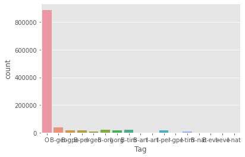
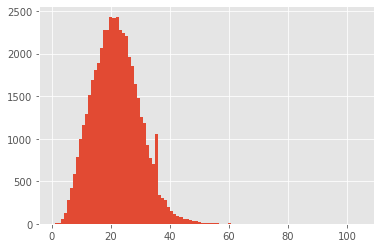
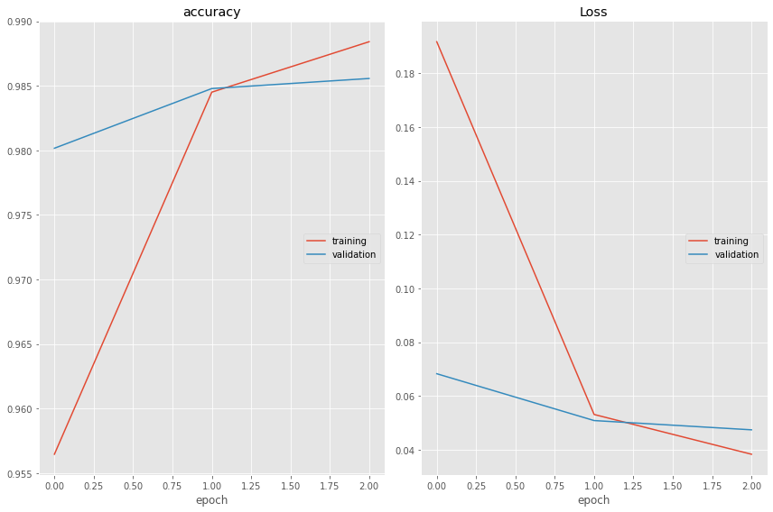

<h2 align=center> Named Entity Recognition (NER) using LSTMs with Keras</h2>

### Task 1: Project Overview and Import Modules


```python
%matplotlib inline
import matplotlib.pyplot as plt
import pandas as pd
import numpy as np
np.random.seed(0)
plt.style.use("ggplot")

import tensorflow as tf
print('Tensorflow version:', tf.__version__)
print('GPU detected:', tf.config.list_physical_devices('GPU'))
```

    Tensorflow version: 2.3.0
    GPU detected: []


### Task 2: Load and Explore the NER Dataset

*Essential info about tagged entities*:
- geo = Geographical Entity
- org = Organization
- per = Person
- gpe = Geopolitical Entity
- tim = Time indicator
- art = Artifact
- eve = Event
- nat = Natural Phenomenon


```python
data = pd.read_csv('data/ner_dataset.csv', encoding='latin1')
data = data.fillna(method='ffill')
data.head(20)
```


<div>
<style scoped>
    .dataframe tbody tr th:only-of-type {
        vertical-align: middle;
    }

    .dataframe tbody tr th {
        vertical-align: top;
    }

    .dataframe thead th {
        text-align: right;
    }
</style>
<table border="1" class="dataframe">
  <thead>
    <tr style="text-align: right;">
      <th></th>
      <th>Sentence #</th>
      <th>Word</th>
      <th>POS</th>
      <th>Tag</th>
    </tr>
  </thead>
  <tbody>
    <tr>
      <th>0</th>
      <td>Sentence: 1</td>
      <td>Thousands</td>
      <td>NNS</td>
      <td>O</td>
    </tr>
    <tr>
      <th>1</th>
      <td>Sentence: 1</td>
      <td>of</td>
      <td>IN</td>
      <td>O</td>
    </tr>
    <tr>
      <th>2</th>
      <td>Sentence: 1</td>
      <td>demonstrators</td>
      <td>NNS</td>
      <td>O</td>
    </tr>
    <tr>
      <th>3</th>
      <td>Sentence: 1</td>
      <td>have</td>
      <td>VBP</td>
      <td>O</td>
    </tr>
    <tr>
      <th>4</th>
      <td>Sentence: 1</td>
      <td>marched</td>
      <td>VBN</td>
      <td>O</td>
    </tr>
    <tr>
      <th>5</th>
      <td>Sentence: 1</td>
      <td>through</td>
      <td>IN</td>
      <td>O</td>
    </tr>
    <tr>
      <th>6</th>
      <td>Sentence: 1</td>
      <td>London</td>
      <td>NNP</td>
      <td>B-geo</td>
    </tr>
    <tr>
      <th>7</th>
      <td>Sentence: 1</td>
      <td>to</td>
      <td>TO</td>
      <td>O</td>
    </tr>
    <tr>
      <th>8</th>
      <td>Sentence: 1</td>
      <td>protest</td>
      <td>VB</td>
      <td>O</td>
    </tr>
    <tr>
      <th>9</th>
      <td>Sentence: 1</td>
      <td>the</td>
      <td>DT</td>
      <td>O</td>
    </tr>
    <tr>
      <th>10</th>
      <td>Sentence: 1</td>
      <td>war</td>
      <td>NN</td>
      <td>O</td>
    </tr>
    <tr>
      <th>11</th>
      <td>Sentence: 1</td>
      <td>in</td>
      <td>IN</td>
      <td>O</td>
    </tr>
    <tr>
      <th>12</th>
      <td>Sentence: 1</td>
      <td>Iraq</td>
      <td>NNP</td>
      <td>B-geo</td>
    </tr>
    <tr>
      <th>13</th>
      <td>Sentence: 1</td>
      <td>and</td>
      <td>CC</td>
      <td>O</td>
    </tr>
    <tr>
      <th>14</th>
      <td>Sentence: 1</td>
      <td>demand</td>
      <td>VB</td>
      <td>O</td>
    </tr>
    <tr>
      <th>15</th>
      <td>Sentence: 1</td>
      <td>the</td>
      <td>DT</td>
      <td>O</td>
    </tr>
    <tr>
      <th>16</th>
      <td>Sentence: 1</td>
      <td>withdrawal</td>
      <td>NN</td>
      <td>O</td>
    </tr>
    <tr>
      <th>17</th>
      <td>Sentence: 1</td>
      <td>of</td>
      <td>IN</td>
      <td>O</td>
    </tr>
    <tr>
      <th>18</th>
      <td>Sentence: 1</td>
      <td>British</td>
      <td>JJ</td>
      <td>B-gpe</td>
    </tr>
    <tr>
      <th>19</th>
      <td>Sentence: 1</td>
      <td>troops</td>
      <td>NNS</td>
      <td>O</td>
    </tr>
  </tbody>
</table>
</div>


```python
print("Unique words in corpus: ", data['Word'].nunique())
print("Unique tags in corpus: ", data['Tag'].nunique())
```

    Unique words in corpus:  35178
    Unique tags in corpus:  17


```python
import seaborn as sns
import tkinter
import matplotlib
matplotlib.use('agg')
import matplotlib.pyplot as plt
%matplotlib inline
sns.countplot(x='Tag', data=data)
```


    <AxesSubplot:xlabel='Tag', ylabel='count'>


    

    


```python
words = list(set(data["Word"].values))
words.append("ENDPAD")
num_words = len(words)
```


```python
tags = list(set(data["Tag"].values))
num_tags = len(tags)
```


```python
num_words, num_tags
```


    (35179, 17)


### Task 3: Retrieve Sentences and Corresponsing Tags


```python
class SentenceGetter(object):
    def __init__(self, data):
        self.n_sent = 1
        self.data = data
        agg_func = lambda s: [(w, p, t) for w, p, t in zip(s["Word"].values.tolist(),
                                                          s["POS"].values.tolist(),
                                                          s["Tag"].values.tolist())]
        self.grouped = self.data.groupby("Sentence #").apply(agg_func)
        self.sentences = [s for s in self.grouped]
```


```python
getter = SentenceGetter(data)
sentences = getter.sentences
```


```python
sentences[0]
```


    [('Thousands', 'NNS', 'O'),
     ('of', 'IN', 'O'),
     ('demonstrators', 'NNS', 'O'),
     ('have', 'VBP', 'O'),
     ('marched', 'VBN', 'O'),
     ('through', 'IN', 'O'),
     ('London', 'NNP', 'B-geo'),
     ('to', 'TO', 'O'),
     ('protest', 'VB', 'O'),
     ('the', 'DT', 'O'),
     ('war', 'NN', 'O'),
     ('in', 'IN', 'O'),
     ('Iraq', 'NNP', 'B-geo'),
     ('and', 'CC', 'O'),
     ('demand', 'VB', 'O'),
     ('the', 'DT', 'O'),
     ('withdrawal', 'NN', 'O'),
     ('of', 'IN', 'O'),
     ('British', 'JJ', 'B-gpe'),
     ('troops', 'NNS', 'O'),
     ('from', 'IN', 'O'),
     ('that', 'DT', 'O'),
     ('country', 'NN', 'O'),
     ('.', '.', 'O')]


### Task 4: Define Mappings between Sentences and Tags


```python
# enumerate() -> add a counter to an iterable and returns it
word2idx = {w: i+1 for i, w in enumerate(words)}
tag2idx = {t: i for i, t in enumerate(tags)}
```


```python
tag2idx
```


    {'I-tim': 0,
     'B-geo': 1,
     'B-art': 2,
     'I-per': 3,
     'I-nat': 4,
     'B-org': 5,
     'I-org': 6,
     'I-art': 7,
     'B-nat': 8,
     'I-gpe': 9,
     'O': 10,
     'B-per': 11,
     'B-tim': 12,
     'B-eve': 13,
     'I-eve': 14,
     'B-gpe': 15,
     'I-geo': 16}


### Task 5: Padding Input Sentences and Creating Train/Test Splits


```python
plt.hist([len(s) for s in sentences], bins=100)
plt.show()
```


    

    


```python
from tensorflow.keras.preprocessing.sequence import pad_sequences
from tensorflow.keras.utils import to_categorical

max_len = 50

X = [[word2idx[w[0]] for w in s] for s in sentences]
X = pad_sequences(maxlen=max_len, sequences=X, padding='post', value=num_words-1)

y = [[tag2idx[w[2]] for w in s] for s in sentences]
y = pad_sequences(maxlen=max_len, sequences=y, padding='post', value=tag2idx["O"])
y = [to_categorical(i, num_classes=num_tags) for i in y]
```


```python
X[0]
```


    array([ 2510,  7049, 17406, 16007, 13230, 30253,  9798, 20715, 17446,
            6588, 26384, 15862, 34464, 28033,  5469,  6588, 20763,  7049,
           31947,  2742,  1032, 20374, 23170, 21365, 35178, 35178, 35178,
           35178, 35178, 35178, 35178, 35178, 35178, 35178, 35178, 35178,
           35178, 35178, 35178, 35178, 35178, 35178, 35178, 35178, 35178,
           35178, 35178, 35178, 35178, 35178], dtype=int32)
           


```python
from sklearn.model_selection import train_test_split
x_train, x_test, y_train, y_test = train_test_split(X, y, test_size=0.1, random_state=1)
```

### Task 6: Build and Compile a Bidirectional LSTM Model


```python
from tensorflow.keras import Model, Input
from tensorflow.keras.layers import LSTM, Embedding, Dense
from tensorflow.keras.layers import TimeDistributed, SpatialDropout1D, Bidirectional
```


```python
input_word = Input(shape=(max_len,))
model = Embedding(input_dim=num_words, output_dim=max_len, input_length=max_len)(input_word)
# SpatialDropout1D -> rather than dropping dropping individual nodes, it drops the entire 1D feature map
model = SpatialDropout1D(0.1)(model)
# Rather than RNN, we are using LSTM to avoid Vanishing Gradient Problem
# using Bi-directional LSTM because, our model can learn from the entire input, rather than just the previous timestamps
model = Bidirectional(LSTM(units=100, return_sequences=True, recurrent_dropout=0.1))(model)
out = TimeDistributed(Dense(num_tags, activation='softmax'))(model)
model = Model(input_word, out)
model.summary()
```

    Model: "functional_1"
    _________________________________________________________________
    Layer (type)                 Output Shape              Param #   
    =================================================================
    input_1 (InputLayer)         [(None, 50)]              0         
    _________________________________________________________________
    embedding (Embedding)        (None, 50, 50)            1758950   
    _________________________________________________________________
    spatial_dropout1d (SpatialDr (None, 50, 50)            0         
    _________________________________________________________________
    bidirectional (Bidirectional (None, 50, 200)           120800    
    _________________________________________________________________
    time_distributed (TimeDistri (None, 50, 17)            3417      
    =================================================================
    Total params: 1,883,167
    Trainable params: 1,883,167
    Non-trainable params: 0
    _________________________________________________________________


```python
model.compile(optimizer='adam',
             loss='categorical_crossentropy',
             metrics=['accuracy'])
```

### Task 7: Train the Model


```python
from tensorflow.keras.callbacks import ModelCheckpoint, EarlyStopping
from livelossplot.tf_keras import PlotLossesCallback
from livelossplot import PlotLossesKeras
import keras
from keras.models import load_model
```


```python
early_stopping = EarlyStopping(monitor='val_accuracy', patience=1, verbose=0, mode='max', restore_best_weights=False)

filename = 'model_ner.h5'
checkpoint = ModelCheckpoint(filename,
                             monitor='val_loss',
                             verbose=1,
                             save_best_only=True,
                             mode='min')

callbacks = [PlotLossesKeras(), early_stopping, checkpoint]

history = model.fit(
    x_train, np.array(y_train),
    validation_split=0.2,
    batch_size=32,
    epochs=3,
    verbose=1,
    callbacks=callbacks
)
```


    

    


    accuracy
    	training         	 (min:    0.956, max:    0.988, cur:    0.988)
    	validation       	 (min:    0.980, max:    0.986, cur:    0.986)
    Loss
    	training         	 (min:    0.038, max:    0.192, cur:    0.038)
    	validation       	 (min:    0.047, max:    0.068, cur:    0.047)
    
    Epoch 00003: val_loss improved from 0.05089 to 0.04745, saving model to model_ner.h5
    1080/1080 [==============================] - 104s 96ms/step - loss: 0.0384 - accuracy: 0.9884 - val_loss: 0.0474 - val_accuracy: 0.9856


### Task 8: Evaluate Named Entity Recognition Model


```python
model_ner = load_model("model_ner.h5")
```


```python
model.evaluate(x_test, np.array(y_test))
```

    150/150 [==============================] - 2s 10ms/step - loss: 0.0490 - accuracy: 0.9854


    [0.049041494727134705, 0.9854211807250977]


```python
i = np.random.randint(0, x_test.shape[0])
p = model.predict(np.array([x_test[i]]))
p = np.argmax(p, axis=-1)

y_true = np.argmax(np.array(y_test), axis=-1)[i]
print("{:15}{:5}\t {}\n".format("word", "True", "Pred"))
print("-"*30)

idx = 0
for w, true, pred in zip(x_test[i], y_true, p[0]):
    print("{:15}{}\t{}".format(words[w-1], tags[true], tags[pred]))
    idx += 1
    if idx == 15:
        break
```

    word           True 	 Pred
    
    ------------------------------
    The            O	O
    Vatican        B-org	B-org
    has            O	O
    announced      O	O
    that           O	O
    U.S.           B-org	B-geo
    President      B-per	B-per
    George         I-per	I-per
    Bush           I-per	I-per
    will           O	O
    meet           O	O
    with           O	O
    Pope           O	O
    Benedict       B-per	I-per
    in             O	O


```python
def text_process(text):
    seq = []
    for w in text.split():
        try:
            seq.append(word2idx[w])
        except:
            seq.append(num_words-1)

    sz = len(seq)
    for _ in range(sz, 50):
        seq.append(num_words-1)
    seq = np.array(seq, dtype=int)
    return seq, sz
```


```python
def get_ner(text):
    seq, sz = text_process(text)
    p = model_ner.predict(np.array([seq]))
    p = np.argmax(p, axis=-1)

    idx = 0
    for w, pred in zip(seq, p[0]):
        if tags[pred] != 'O':
            print("{:15}\t{}".format(words[w-1], tags[pred]))
        idx += 1
        if idx == sz:
            break
```


```python
get_ner('Sunday is close day for London .')
```

    Sunday         	B-tim
    London         	B-geo


```python
get_ner('I will go to London from Indonesia Sunday Morning .')
```

    London         	B-geo
    Indonesia      	B-geo
    Sunday         	B-tim
    Morning        	I-tim


```python
get_ner('U.S. President George Bush will visit the Vatican city Tomorrow Morning .')
```

    U.S.           	B-org
    President      	B-per
    George         	I-per
    Bush           	I-per
    Vatican        	B-org
    Tomorrow       	B-geo
    Morning        	I-org

